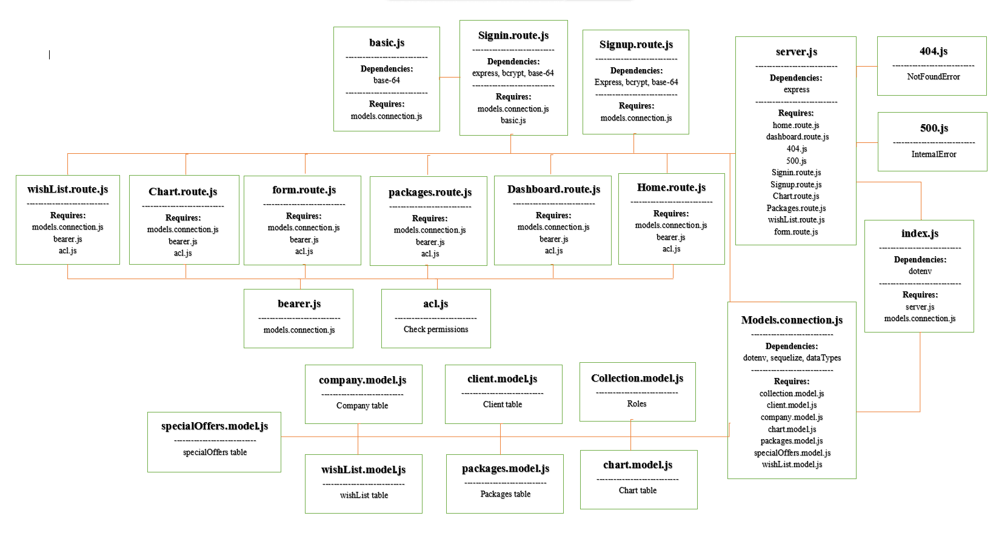
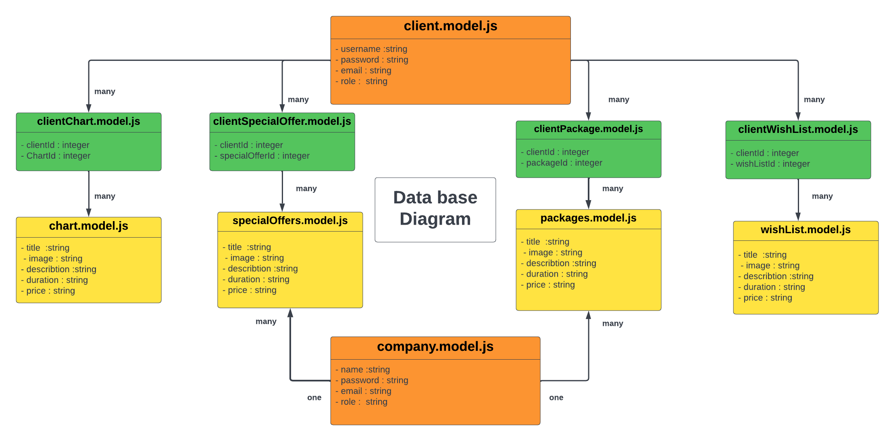

# Ticket-System-Server

Name of group members:

1. Bahaa Nimer
2. Saleh Ziad
3. Mohammad Haimour
4. Ahmad Tayseer
5. Ahamd Helwa

## description of the project

This project is an app consider as a link between service providers and clients.

This app provide tickets for tourism trips that companies present, then the clients can look at them, book and pay online.

And the app provide a service for the users to contact the support team for any problems that may face them.

## UML Diagram

## DataBase Diagram

