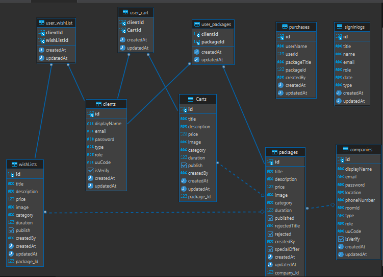

# Ticket-System-Server (ticketcom)

## Angry Nerds Group

## Name of group members

1. Bahaa Nimer (Team Leader)
2. Saleh Ziad
3. Mohammad Haimour
4. Ahmad Tayseer
5. Ahamd Helwa

## description of the project

This project is an ecommerce website consider as a link between service providers and clients.

This website provide tickets for tourism trips that companies present, then the clients can look at them, book and purchase.

And the website provide a service for the users to contact the support team for any problems that may face them.

## Heroku Link

[Heroku](https://midterm-project-ltuc.herokuapp.com/)

## Configuration

- README.md - contains documentation
- .env - contains env variables (should be git ignored)
- .gitignore - contains a .gitignore file
- package.json - contains npm package config
  - create a test script for running tests
  - create a start script for running your server
- index.js - the entry point for your application
- src/ - contains your core application files and folders and server file which contains the main server
- **test**/ - contains unit tests
- asset - contains images
- client - contains files for chat system
- notification - contain files for notification system

## Dependecies

```js
Backend:
{
    "base-64": "^1.0.0",
    "bcrypt": "^5.0.1",
    "cors": "^2.8.5",
    "dotenv": "^16.0.1",
    "express": "^4.18.1",
    "jest": "^28.1.3",
    "jsonwebtoken": "^8.5.1",
    "nodemailer": "^6.7.7",
    "pg": "^8.7.3",
    "sequelize": "^6.21.3",
    "sequelize-cli": "^6.4.1",
    "socket.io": "^4.5.1",
    "sqlite3": "^5.0.10",
    "supertest": "^6.2.4",
    "uuid": "^8.3.2",
    "uuidv4": "^6.2.13"
}
```
Frontend:
{
    "@fortawesome/fontawesome-svg-core": "^6.2.0",
    "@fortawesome/free-regular-svg-icons": "^6.2.0",
    "@fortawesome/free-solid-svg-icons": "^6.2.0",
    "@fortawesome/react-fontawesome": "^0.2.0",
    "@testing-library/jest-dom": "^5.16.5",
    "@testing-library/react": "^13.4.0",
    "@testing-library/user-event": "^13.5.0",
    "axios": "^0.27.2",
    "bootstrap": "^5.2.1",
    "bootstrap-icons": "^1.9.1",
    "firebase": "^9.10.0",
    "js-base64": "^3.7.2",
    "mdb-react-ui-kit": "^4.2.0",
    "node-sass": "^7.0.3",
    "react": "^18.2.0",
    "react-bootstrap": "^2.5.0",
    "react-card-slider-component": "^1.0.9",
    "react-cookie": "^4.1.1",
    "react-cool-form": "^0.4.1",
    "react-dom": "^18.2.0",
    "react-file-base64": "^1.0.3",
    "react-icons": "^4.4.0",
    "react-router-dom": "^6.4.1",
    "react-scripts": "5.0.1",
    "reactstrap": "^9.1.4",
    "sass": "^1.55.0",
    "sweetalert2": "^11.4.37",
    "sweetalert2-react-content": "^5.0.3",
    "swiper": "^8.4.2",
    "universal-cookie": "^4.0.4",
    "uuid": "^9.0.0",
    "web-vitals": "^2.1.4"
  }

## Authrization

clients - READ

companies - READ/CREATE/UPDATE

admins - READ/CREATE/UPDATE/DELETE

## Routes

## Auth Routes

| method | path                                         | Description            |
| ------ | -------------------------------------------- | ---------------------- |
| POST   | /auth/user/signup                            | Signup client account  |
| POST   | /auth/companies/signup                       | Signup company account |
| POST   | /auth/verify                                 | verify account         |
| POST   | /auth/login                                  | Signin account         |
| POST   | /auth/send/forgetPassword                    | forget password        |
| POST   | /auth/hendle/forgetPassword?token=tokenValue | update password        |
| GET    | /auth/users                                  | get user               |

## Admin Routes

### Packages

| method | path                                                 | Description                |
| ------ | ---------------------------------------------------- | -------------------------- |
| GET    | /admin/package/accept?type=client&id=idForThePackage | accept package to publish  |
| GET    | /admin/package?type=client                           | get all packages           |
| GET    | /admin/package/published?type=client                 | get published packages     |
| GET    | /admin/package/notpublished?type=client              | get not published packages |
| POST   | /admin/package/reject?type=client&id=idForThePackage | reject package             |
| GET    | /admin/package/reject?type=client                    | get rejected packages      |
| DELETE | /admin/package/delete?type=client&id=idForThePackage | delete package             |
| GET    | /admin/package/purchase?type=client                  | get all purchased packages |

### Users

| method | path                                                 | Description    |
| ------ | ---------------------------------------------------- | -------------- |
| GET    | /admin/users?type=client                             | get all users  |
| DELETE | /admin/user/delete?type=client&id=idForTheUser       | delete user    |
| DELETE | /admin/company/delete?type=client&id=idForTheCompany | delete company |

### Logs

| method | path                           | Description  |
| ------ | ------------------------------ | ------------ |
| GET    | /admin/logs/signin?type=client | sign-in logs |

## Company Routes

| method | path                                                 | Description                       |
| ------ | ---------------------------------------------------- | --------------------------------- |
| CREATE | /company/create?type=company                         | create a package or special offer |
| DELETE | /company/package/delete/idForTheCompany?type=company | delete company account            |
| GET    | /company/packages?type=company                       | get all packages for company      |
| GET    | /company/packages/accepted?type=company              | get accepted packages for company |
| GET    | /company/packages/rejected?type=company              | get rejected packages for company |

## User Routes

### Cart

| method | path                                   | Description              |
| ------ | -------------------------------------- | ------------------------ |
| CREATE | /client/cart/:idForPAckage?type=client | put a package on cart    |
| DELETE | /client/cart/:idForPAckage?type=client | remove package from cart |
| GET    | /client/cart?type=client               | get all packages in cart |

### WishList

| method | path                                       | Description                  |
| ------ | ------------------------------------------ | ---------------------------- |
| CREATE | /client/wishlist/:idForPAckage?type=client | put a package on wishlist    |
| DELETE | /client/wishlist/:idForPAckage?type=client | remove package from wishlist |
| GET    | /client/wishlist?type=client               | get all packages in wishlist |

### Chat

| method | path                       | Description                              |
| ------ | -------------------------- | ---------------------------------------- |
| GET    | /client/roomid?type=client | get rooms id for chatting with companies |

### Packages

| method | path                         | Description      |
| ------ | ---------------------------- | ---------------- |
| GET    | /client/packages?type=client | get all packages |

### Special Offers

| method | path                              | Description                     |
| ------ | --------------------------------- | ------------------------------- |
| GET    | /client/specialOffers?type=client | get all special offers packages |

## Home Routes

| method | path                | Description                     |
| ------ | ------------------- | ------------------------------- |
| GET    | /home/packages      | get all packages                |
| GET    | /home/specialOffers | get all special offers packages |

## Installation

ticket-system-server requires Node.js v14+ to run.

Install the dependencies and devDependencies and start the server.

    cd ticket-system-server
    npm i
    npm start

For production environments...

    NODE_ENV=production node index

## License

MIT

## UML Diagram


## DataBase Diagram



## WireFrame

[WireFrame](./WireFrame.md)

## Home Route Test


